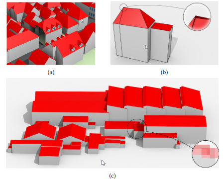

# Automatic repair of 3D (city) models: AUTOr3pair
_Version 0.0 of proof of concept for thesis Lisa Keurentjes: 1 November release of 1.0_ 

<p align="center">
  
</p>


A significant amount of 3D city models is not considered valid to the standards needed, 
they contain geometric as well as topological errors. Some examples of these errors are:
* duplicate vertices
* missing surfaces (a)
* non-watertight solids (b)
* intersecting volumes (c)

<p align="center">
  
</p>


Errors hinder the further analyzing or processing of these models, so pre-processing of the models needs to be done. 
Since manual repair of 3D City models is very time-consuming and prone to errors, 
automatic repair methods are highly desirable. 

AUTOr3pair is an automatic repair method written as proof of concept of my thesis ([A framework for automatic repair of 3D city
models](https://www.overleaf.com/project/62e7956cf561ac2c8ea86e7c), todo later add repository link).
In short, it verifies whether a 3D primitive respects the definition as given in [ISO19107](http://www.iso.org/iso/catalogue_detail.htm?csnumber=26012), 
with the help of [Val3dity](https://github.com/tudelft3d/val3dity/). If the primitive is not valid a repair will be done.
The chosen repair will be based on the use-case (give by the user). For some use cases there are additional requirements,
for example Computational fluid dynamics (CFD) and Energy Demand Analysis need all buildings to be watertight solids, 
while the data could consist of Multi-surface primitives. Such additional requirements will also be tested and repaired.

The automatic repair of the following 3D primitives is fully supported:

- ``MultiSurface``
- ``CompositeSurface``
- ``Solid``
- ``MultiSolid``
- ``CompositeSolid``

Inner rings in polygons/surfaces are supported and so are cavities in solids (also called voids or inner shells). 
Spheres and line strings are not supported.


## Usage
AUTOr3pair is a C++ program designed to repair 3D city models and can be executed either through the command line interface or within an Integrated Development Environment (IDE).

### Building the programm
Before running AUTOr3pair, the program must be built using CMake. 
The CMake build system manages the building process across different platforms, 
ensuring that the necessary build files are generated. 
To build the program, navigate to your chosen build directory and use the following command:
```
cmake --build [/your/build/location] --target AUTOr3pair [optional parameters]
```
- `[/your/build/location]`: Specify the path to your build directory.
- `--target AUTOr3pair`: This ensures that CMake builds the AUTOr3pair target.
- `[optional parameters]`: Additional parameters can be provided to customize the build process. For example, specifying the build configuration (`--config Release` or `--config Debug`).

Once built, the AUTOr3pair executable will be located in your build directory, ready to repair 3D city models.

### Running the programm
After successfully building the program, you can use AUTOr3pair to repair 3D city models through the command line. 
The program requires one or two inputs depending on the use case. and can optionally have a specif LOD to repair.

```
[/your/build/location/]AUTOr3pair [3d city model to repair] [optional: Use Case (file)] [optional: LOD to repair]
```
**Inputs**:
1. `[3D city model to repair]`: This is the path to the 3D city model file that you want to repair. AUTOr3pair supports various file formats (discussed below).
2. `[optional: Use Case (file)]`: This parameter allows you to specify a predefined use case or a custom user preference file that contains specific standards for the repair process. If not provided, the program will use default repair standards.
3. `[optional: LOD to repair]`: The optional Level of Detail (LOD) parameter can be added to limit the repair process to a specific LOD in the model (explained further below).

#### Supported File Formats

AUTOr3pair supports multiple 3D city model file formats. The program can handle these formats:

- **CityJSON**: A JSON-based encoding for 3D city models.
    ```
    [/your/build/location/]AUTOr3pair [your_file_to_repair.json]
    ```
  Example:
    ```
    /build/AUTOr3pair city_model.json
    ```

- **OBJ**: A standard format for representing 3D geometry (e.g., vertices, textures, and more).
    ```
    [/your/build/location/]AUTOr3pair [your_file_to_repair.obj]
    ```
  Example:
    ```
    /build/AUTOr3pair model.obj
    ```
#### Use Cases

If only the input file is provided, the default repair standards are applied. 
However, if you have specific requirements, such as those determined by a particular use case, you can provide a use case or a user preferences file to adjust these standards accordingly.
AUTOr3pair supports various predefined use cases that tailor the repair process for different purposes. These include:
- [Visualisation](#headUC)
```
[/your/build/location/]AUTOr3pair [your_file_to_repair.json] VISUALIZATION
```
- [CFD](#headUC)
```
[/your/build/location/]AUTOr3pair [your_file_to_repair.json] CFD
```
- [Energy Demand](#headUC)
```
[/your/build/location/]AUTOr3pair [your_file_to_repair.json] ENERGYDEMAND
```
- [Solar Power estimation](#headUC)
```
[/your/build/location/]AUTOr3pair [your_file_to_repair.json] SOLARPOWER
```
- [UserInputfile](docs/UserInput.md) 
```
[/your/build/location/]AUTOr3pair [your_file_to_repair.json] [your_prefferences.json]
```
This file can be used to customize parameters such as accuracy thresholds, element types, and more.

#### Level of Detail (LOD)

3D city models in JSON can contain various Levels of Detail (LOD).
AUTOr3pair allows you to target specific LODs during the repair process 
by adding a `-LOD[number]` argument after the input file.

For example, to repair only LOD 1.0:
```
[/your/build/location/]AUTOr3pair [your_file_to_repair.json] -LOD1.0
```

Combining Use Cases and LOD targeting is also possible:
```
[/your/build/location/]AUTOr3pair [your_file_to_repair.json] SOLARPOWER -LOD1.0
```

Or, if you are using a user-defined preferences file:
```
[/your/build/location/]AUTOr3pair [your_file_to_repair.json] [your_preferences.json] -LOD1.0
```

This flexibility allows you to focus repairs on specific sections of the model based on the LOD, making the repair process more efficient and suited to your exact needs.


### Standards
For the repair process Standards are used. Below are the Default standards described.
As user you can also change the Standards by inputting a user prefferences `json`, 
in [this file](docs/UserInput.md) is explained in more depth where these Standards are used 
and how you can make your own input `json`. 

The  default standards used for the program are:
**Input parameters**:
- `OBJ_geomtype`: `"Solid"`
- `ExtendScope`: `[]`

**Output parameters**:
- `ShowProgress`: `TRUE`
- `Debugging`: `FALSE`
- `AddAttribute`: `FALSE`

**Repair Depth(s)**:
- `maxRepairDepth`: 50
- `TotalRepairDepth`: 500

**Geometry repair standards**:
- `solve_all`: `TRUE`
- `errors_to_solve`: `[]`

**val3dity tolerances**:
- `overlap_tol`: -1
- `planarity_d2p_tol`: 0.01
- `planarity_n_tol`: 20
- `snap_tol`: 0.001

|                     | **Default AUTOr3pair** | **CFD** | **Energy Demand** | **Visualization** | **Solar Power Estimation** |
|---------------------|------------------------|---------|-------------------|-------------------|---------------------------|
| `KeepEverything`    | 🟥 FALSE               | 🟥 FALSE| 🟥 FALSE          | ✅ TRUE           | ✅ TRUE                    |
| `SkipLowRepairs`    | 🟥 FALSE               | ✅ TRUE | ✅ TRUE           | 🟥 FALSE          | 🟥 FALSE                   |
| `Watertight`        | 🟥 FALSE               | ✅ TRUE | ✅ TRUE           | 🟥 FALSE          | 🟥 FALSE                   |
| `Orientation`       | 🟥 FALSE               | 🟥 FALSE| 🟥 FALSE          | ✅ TRUE           | ✅ TRUE                    |
| `MergeTol`          | ↔️ 0.1                  | ↔️ 0.25 | ↔️ 0.75           | ↔️ 0.1             | ↔️ 0.5                     |
| `Overlap`           | ✅ TRUE                | 🟥 FALSE| 🟥 FALSE          | 🟥 FALSE          | 🟥 FALSE                   |
| `SemanticsAdd`      | ✅ TRUE                | 🟥 FALSE| ✅ TRUE           | 🟥 FALSE          | ✅ TRUE                    |
| `SemanticsValidate` | ✅ TRUE                | 🟥 FALSE| 🟥 FALSE         | 🟥 FALSE          | ✅ TRUE                    |
| `Triangulate`       | 🟥 FALSE               | ✅ TRUE | 🟥 FALSE          | 🟥 FALSE          | 🟥 FALSE                   |
| `Simplification`    | 🟥 FALSE               | ✅ TRUE | 🟥 FALSE          | 🟥 FALSE          | 🟥 FALSE                   |
| `RemeshSlivers`     | 🟥 FALSE               | ✅ TRUE | 🟥 FALSE          | 🟥 FALSE          | 🟥 FALSE                   |


