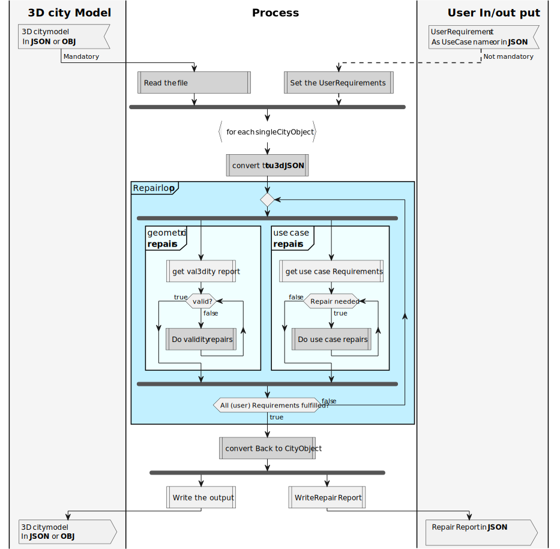
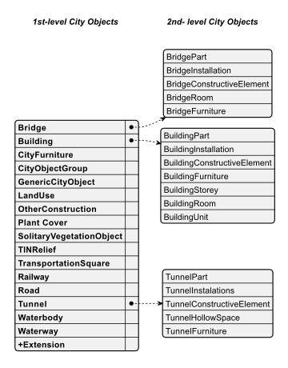
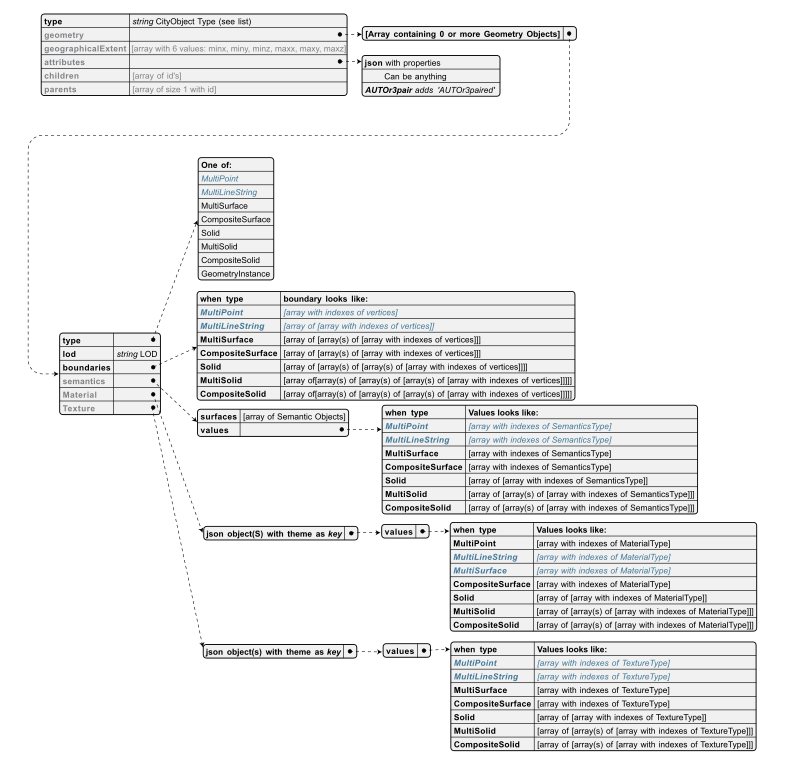
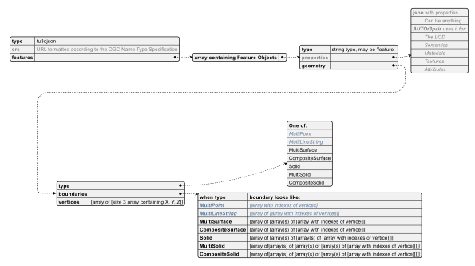
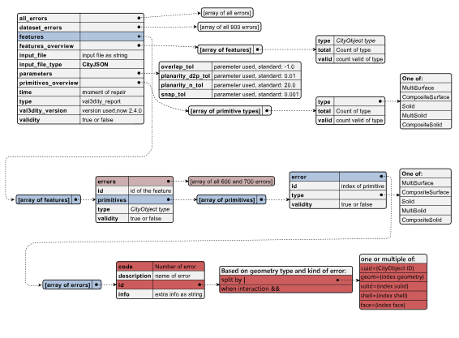

# PlantUML Plots
Several Plots are made to explain:
- Workflow
- File schema's of 3D City Objects
- File schema's of Reports
- Relations

All diagrams are saved in both SVG and EPS depending, so it can be used for all use cases.
Some of the diagrams are Post-Processed or even upgrade in adobe Illustrator so the sometimes have 
small changes compared to the Plant-UML made model.

## Workflow

## File schema's of 3D City Objects

### CityJSON

#### CityObject

###### CityObjecttypes

#### MetaData

### TU3DJSON

## File schema's of Reports

### Val3dityReport

### RepairReport

## Relations

### CityJSON CityObject to TU3dJSON

### Inheritance of Geometry classes