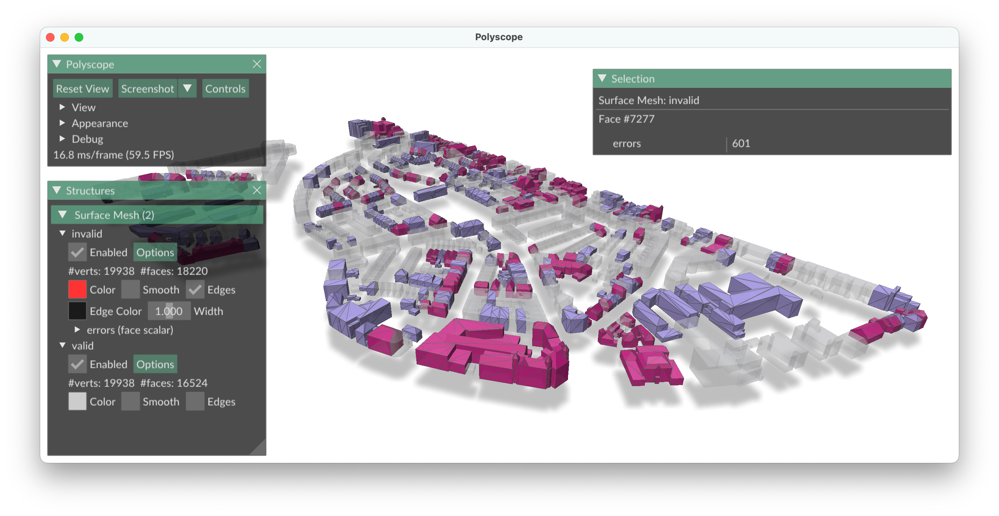

# vizR3pair: a simple visualiser for AUTOr3pair reports.
At this moment the visualizer only works for CityJSON, I want to extend it later on for more file types.
Based on Viz3dity visualizer



## dependencies

```
pip install polyscope
pip install numpy
pip install click
pip install tqdm
pip install mapbox-earcut
```
## to view the errors

```
python vizR3pair.py test_data/city.json  test_data/report.json
```


