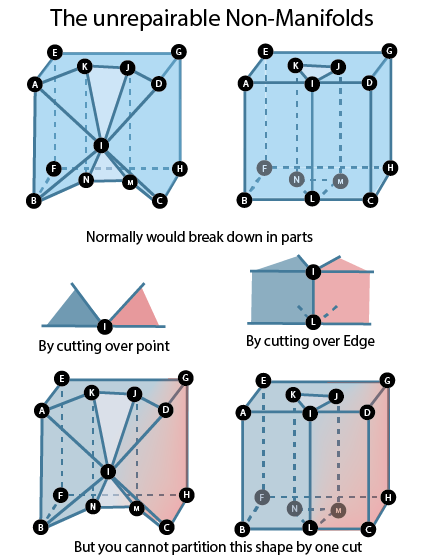

# Test data
All testdata and describe what it is

## Unit tests

### Geometry repairs
CityJSON geometries can exist as multiple geometry types, the geometry type is described in the file name.

CityJSON files have a version with and without Semantics and materials. 
They can be found in the corresponding directory and are marked with SM if they are present.

OBJ files are made when error is possible.

#### Ring level:
3D city models:
* **101**: Cube top face a line (with only 2 vertices)
* **102**: Cube with one duplicate vertex (repeated in a ring)
* **104**: Unit cube where top face has a bow tie
* **104_1**: Unit cube with top face having a self-intersecting surface (2D invalid), where 2 out of 3 triangles that are forming a square are bundled as one polygon (which self-intersects)
* **104_2**: One face closing in itself before the last vertex
* **104_3**: Similar to 104_1 but triangles meet in one corner of the square
* **104_4**: cube with top face having small fold (Kevin Wiebe's case); vertical shift can't be made (old pfold2.poly)
* **Ring_all**: cube with combination of all ring errors in one cube

User input:
* **Ring**: extend scope with GenericCityObject and focus only on ring repairs
* **Ring_skip**: like Ring, but "SkipLowRepairs" is set to true

#### Polygon level
3D city models:
* **201**: Unit cube with intersecting rings in top face
* **201_1**: A single 3D polygon with an interior ring that instersects its exterior
* **201_2**: Unit cube with a duplicate inner ring top face
* **203**: Unit cube where the top face has 5 vertices, one of them (8) is not on the plane of the other 4 (+0.05)
* **203_1**: Unit cube with a rectangular hole drilled through it, where one vertex (8) on the inner ring in the top face of the cube is not on the plane of the face (+0.5)
* **203_2**: Same as 203 but non-planar vertex is +0.1
* **203_3**: same as 203 but non planar is +0.02 (so projection is used)
* **204_1**: Unit cube with small fold in the top face 
* **205**: Unit cube with a polygon with interior disconnected in top face
* **206**: Unit cube with a hole in top face located outside (in 2D the top face is not acc. to SFS)
* **206_1**: Unit cube with a hole in top face located outside and the hole is intersecting the exterior in one point
* **207**: Unit cube with a polygon with nested rings in top face
* **207_1**: Unit cube with a polygon with a nested ring in a nested ring in the top face
* **208**: Unit cube with a hole (inner ring) in the top face having same orientation as outer ring

User input:
* **Poly**: extend scope with GenericCityObject and focus only on poly repairs and lower order repairs
* **Poly_skip**: like Poly, but "SkipLowRepairs" is set to true
* **Poly_keep**: like Poly, but "KeepEverything" is set to true
* **Poly_tollerance_distance_plane**: like Poly, but "planarity_d2p_tol" is set to 0.001

#### Shell level
* **301**: Flat cube, ie with volume of 0, only 2 surfaces
* **301_1**: Cube with only 3 surfaces
* **301_2**: tri triangles on the same plane
* **302**: Unit cube with one face missing (bottom one)
* **302_1**: Unit cube with a hole (inner ring) in the top face
* **302_2**: A vertex in the top surface does not close the shell (0.01 discrepancy), GML cube
* **302_3**: Cube with torus, which misses a face of the "inside" torus
* **303**: Unit cube with one dangling face touching the cube at one point only. The dangling face is the last in the list
* **303_1**: 2 unit cubes touching at one vertex
* **303_1b**: same as 303 but 2 unit cubes touching at one vertex are different vertices
* **303_2**: Torus where the hole in the top/bottom faces touches the side surfaces
* **303_cs**: one cube with a non-manifold vertex. As a Solid error 302, but CompositeSurface 303. Jeff Coukell's case.
* **303_4**: Unit cube with one extra face in the middle, splitting the cube in two parts
* **305**: Cube with one extra face floating in the air, not touching
* **305_1**: 2 unit cubes not touching at all, one above the other separated by 1unit
* **306**: House with tip below the ground
* **306_1**: House with tip touching the bottom faces
* **307**: Unit cube with one face (face 0) with opposite orientation
* **307_1**: Unit cube with a top surface composed of 2 polygons with opposite orientation

User input:
* **Shell**: extend scope with GenericCityObject and focus only on shell repairs and lower order repairs
* **Shell_keep**: like Shell, but "KeepEverything" is set to true
* **Shell_watertight**: like Shell, but "Watertight" is set to true
* **Shell_orientation**: like Shell, but "Orientation" is set to true
* **Shell_triangulation**: like Shell, but "Triangulated" is set to true

#### Solid level

3D city models:
* **401**: An inner-pyramid that pierces through the top of basecube (by 0.00001). Oracle agrees: oracle=54512
* **401_1**: basecube = An inner-pyramid that is outside of the shell of basecube, but pierces inside it (by 0.00001)
* **401_2**: Two cavities in basecube that share a face
* **401_3**: Two cavities in basecube that partly share a face
* **401_4**: A cavity which bottom face is shared with the bottom face of basecube
* **401_5**: A cavity which touches bottom and top face of basecube and splits volume
* **401_6**: A cavity which touches bottom and top face of basecube
* **401_7**: Duplicate cavities in basecube (original 402)
* **401_8**: basecube with inner shell that is also the base cube
* **403**: A pyramid cavity that is completely outside of the outer shell of basecube
* **404**: 404 is a blocker that divides the cube into two parts
* **405**: Pyramid with the normals pointing inwards
* **405_1**: basecube with inner Pyramid with the normals pointing outwards

User input:
* **Solid**: extend scope with GenericCityObject and focus only on solid repairs and lower order repairs
* **Solid_keep**: like Solid, but "KeepEverything" is set to true
* **Solid_watertight**: like Solid, but "Watertight" is set to true
* **Solid_keep_watertight**: like Solid, but "KeepEverything" and "Watertight" is set to true

#### Solid interaction level
* **501**: CompositeSolid with 3 cubes adjacent, where cube 1-2 overlap by 1cm
* **501_1**: CompositeSolid with (1) basecube + inner_shell (2) inner_shell filling the void
* **502**: CompositeSolid with 3 cubes, where cube 1-2 are identical
* **503**: CompositeSolid with 3 cubes, where cube 1 is not connected to other

User input:
* **SolidI**: extend scope with GenericCityObject and focus only on solid interaction repairs and lower order repairs
* **Solid_watertight**: like SolidI, but "Watertight" is set to true
* **Solid_Merge0**: like SolidI, but "MergeTol" is set to 0
* **Solid_Merge1**: like SolidI, but "MergeTol" is set to 1

#### Sub Part level
* **601**:    A Building with 2 BuildingParts that overlap by 50 units
* **601_1**:  A Building with 6 BuildingParts, part of open dataset Den Haag. Parts overlap by <1cm, with overlap_tol 0.01 it's valid

User input:
* **SubPart**: extend scope with GenericCityObject and focus only on subpart repairs and lower order repairs
* **SubPart_Merge0**: like SubPart, but "MergeTol" is set to 0
* **SubPart_Merge1**: like SubPart, but "MergeTol" is set to 1

### (Use case) Parameters
This section will describe specific parameters that can be adjusted during repair operations, 
including the tolerance for geometric validation, planarity checks, and volume consistency.

* **Semanticsbuilding** is a building with semantic properties

User input:
* **KeepEverything**: Extends scope with GenericCityObject and "KeepEverything" is set to false.
* **MergeTOL0.1**: Extends scope with GenericCityObject and sets the merge tolerance to 0.1.
* **MergeTOL0.9**: Extends scope with GenericCityObject and sets the merge tolerance to 0.9.
* **orientation**: Extends scope with GenericCityObject and "Orientation" is set to false.
* **Overlap**: Extends scope with GenericCityObject and "Overlap" is set to true.
* **RemeshSlivers**: Extends scope with GenericCityObject and "RemeshSlivers" is set to false.
* **semanticsAdd**: Extends scope with GenericCityObject and "SemanticsAdd" is set to true.
* **semanticsValidate**: Extends scope with GenericCityObject and "SemanticsValidate" is set to true.
* **Simplification**: Extends scope with GenericCityObject and "Simplification" is set to false.
* **SkipLowRepairs**: Extends scope with GenericCityObject and "SkipLowRepairs" is set to false.
* **SnapOverlap**: Extends scope with GenericCityObject to resolve overlaps.
* **Triangulation**: Extends scope with GenericCityObject and "Triangulation" is set to false.
* **watertight**: Extends scope with GenericCityObject and "Watertight" is set to false.

### Pre-/postprocessing
Details of any preprocessing or postprocessing required before or after running repairs on 3D models. This might include data normalization or optimization steps for better repair accuracy.

* **CITYJSON_cube_change_scale**: Cube where in the output scale is changed to output only int
* **CITYJSON_cube_Csolid**: Composite Solid cube with only one cube so will output as Solid
* **CITYJSON_cube_duplicate**: Cube with duplicate vertex
* **CITYJSON_cube_duplicateSNAP**: Cube with duplicate vertex based on snap tollerance
* **CITYJSON_cube_geographicalExtent.**: Cube with geographicalExtent which will be changed
* **CITYJSON_cube_Msolid**: Multi Solid cube with only one cube so will output as Solid
* **CITYJSON_cube_OrphanVertex**: Cube with orphane vertices in list
* **CITYJSON_cube_texture**: Cube with textures which will be deleted
* **OBJ_cube_round_vertices**: OBJ cube where vertices are rounded

User input:
* **GenericCityObject**: Extends scope with GenericCityObject

### input file formats
Supported input file formats for the geometry repair framework include:
- CityJSON
- OBJ
- Not know data types

## Thesis data
This section includes the test data used for the [MSc thesis](../docs/msc_geomatics_thesis_LisaKeurentjes.pdf), "An Automatic Geometry Repair Framework for Semantic 3D City Models." 
The results can also be found in the [PDF](../docs/msc_geomatics_thesis_LisaKeurentjes.pdf) version uploaded.

### Repair and Evaluation of Open-Data 3D City Models

In this section, the focus is on repairing and evaluating open-data 3D city models. Two main factors are considered for repairs:
1. **Validity Percentage** - Evaluated using `val3dity`, comparing valid percentages of buildings before and after the repair process.
2. **Geometric Difference** - Measured using the Hausdorff distance, which quantifies the spatial differences between geometry sets.

### 3DBAG
The 3D BAG dataset contains 3D building models of the Netherlands and can be downloaded from the [3D BAG Download site](https://3dbag.nl/nl/download). The dataset includes models at multiple levels of detail and has known geometric errors from data processing inconsistencies.

The tiles evaluated are around the old center of Leiden, comprising 20 small and one larger tile. Validity percentages range from 85% to 99%, with existing geometric errors found at the Ring, Polygon, and Shell levels.

Repairs are conducted with default parameters, adjusting `SemanticsValidate` to false for efficiency. Post-repair validity percentages reach 99%, with some tiles only one feature away from 100%. Remaining errors are attributed to rounding issues during the vertex list conversion.

### Brussel
Brussel offers an open dataset of 3D buildings, previously available in CityGML format but now only accessible through older tiles. The dataset contains MultiSurfaces, leading to various ring and polygon errors, along with complications related to surface normals orientation.

Initial validity scores are low at 62%, but improvements are noted post-repair. The dataset's lower quality and the conversion process contribute to ongoing geometric issues, requiring further refinements before P5.

### Data-sets from CityJSON Website
Experiments using datasets from the [CityJSON website](https://www.cityjson.org/datasets/#some-randomly-selected-cities) compare various use cases on model validity and geometric distance. Notable observations include low validity scores for some cities, with high Hausdorff distances attributed to poorly handled alpha wraps.

## Unrepairebale Non Manifold
Examples of non-repairable manifolds, where the topology makes automated repair impossible with the current methods. These files will be used to develop more advanced repair strategies in the future.

  

## Demo
A curated set of files used for demonstrations. These include the key cases mentioned above and are copied here for faster and easier access during demos. The files are located in the `Data` directory of the [AUTOr3pair repository](https://github.com/Lkeurentjes/AUTOr3pair).

