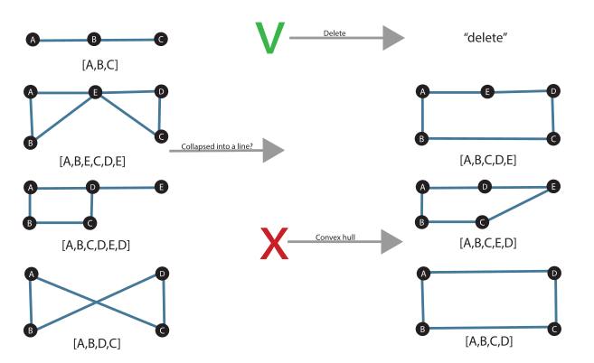
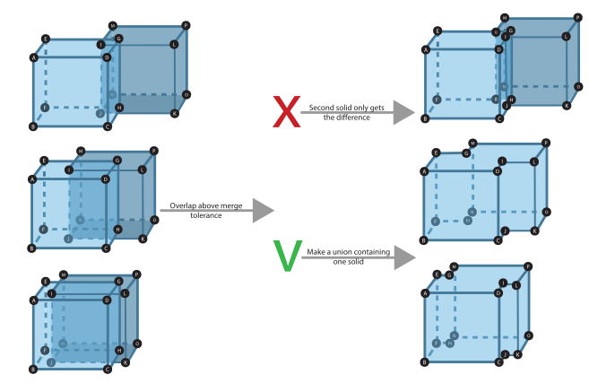
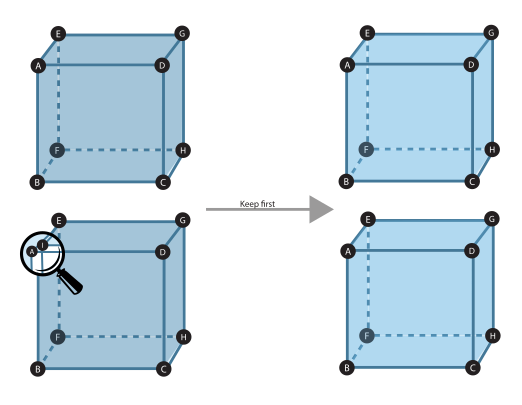

# Methodology for Automatic Repair of Semantics 3D City Models
The workflow for the proposed repair methodology is outlined in the figure below. The automatic repair process is done through a repair loop. This chapter focuses on geometric repairs and the use of Val3dity for validating and identifying errors. The repairs are organized per primitive level, as outlined in sections below. Each approach preserves semantics and materials where possible.

## Validation by Val3dity
Val3dity validates geometries and reports errors at three levels:
1. **File errors** (9xx) – Out of scope for this thesis.
2. **Feature errors** (6xx, 7xx) – These refer to city model objects like buildings.
3. **Geometry errors** (1xx-5xx) – These errors relate to geometric primitives.

A Val3dity report can be used to trigger repairs for invalid locations. Since Val3dity works hierarchically, repairs are applied per level, assuming valid lower-level primitives.

Val3dity uses tolerances for handling small errors. Three situations where tolerance is applied include:
- **Planarity of polygons** (default tolerance is 1mm for vertices and 20° for normals).
- **Snapping close vertices** (default tolerance 1mm).
- **Distance between primitives** (used for ensuring no overlaps or disjoint parts).

### Figure: Example of tolerance applied

## Ring-Level Repair Approaches
Geometries should meet specific standards at the ring level. Below are repair strategies for common errors detected by Val3dity:

### 101 - Too Few Points
When a ring has only one line (a curve with two points), deletion is the only option.

### 102 - Consecutive Points Same
If two consecutive points are the same, one is kept. This repair ensures that the ring doesn't become invalid afterward.

### 103 - Ring Not Closed
Since this error is not applicable to CityJSON or OBJ formats, it is out of scope. However, it may be addressed in GML or JSON-FG formats by closing the ring.

### 104 - Ring Self-Intersection
When a ring self-intersects, the repair involves deleting or applying a convex hull to restore a valid structure.

## Polygon-Level Repair Approaches
Polygons are simple, planar surfaces that must adhere to certain rules:

### 201 - Intersecting Rings
Boolean operations are used to repair intersections between rings in a polygon.

### 202 - Duplicate Rings
Preferably, only the first of the duplicate rings is kept.

### 203 - Non-Planar Polygon (Distance to Plane)
This repair either triangulates the polygon or projects outlier points onto a new plane.

### 204 - Non-Planar Polygon (Normal Deviation)
When a "fold" exists in the polygon, the affected triangles are projected onto a new plane.

### 205 - Polygon Interior Disconnected
If the polygon's interior is disconnected, it is split into multiple polygons.

### 206 - Inner Ring Outside
If an inner ring is outside the exterior ring, it is either deleted or converted into a new polygon.

### 207 - Inner Rings Nested
Nested inner rings are either deleted or reversed and added as new polygons.

### 208 - Orientation Rings Same
The orientation of the exterior and interior rings must be opposite. Inner rings are reversed if needed.

## Shell-Level Repair Approaches
Shells are defined by closed polygon sets and must meet specific validity standards.

### 300 - Not Valid 2-Manifold
If no local repair is possible, a global method like alpha wrap is applied to generate a valid triangulation.

### 301 - Too Few Polygons
A shell must have at least four polygons. Local methods like hole filling are attempted first, followed by alpha wrapping if needed.

### 302 - Shell Not Closed
Holes and gaps are reconstructed using naked edge detection or alpha wrapping.

### 303 - Non-Manifold Case
In this case, connected components are split along overused edges or vertices.

### 305 - Multiple Connected Components
Disconnected parts are either deleted or converted into MultiSurface or MultiSolid, based on user requirements.

### 306 - Shell Self-Intersection
Intersecting faces are deleted, and holes are patched. Alpha wrapping is used as a fallback.

### 307 - Polygon Wrong Orientation
Wrongly oriented polygons are flipped to restore a valid shell.

## Solid-Level Repair Approaches
Solids are defined by one or more shells, and common errors include:

### 401 - Intersecting Shells
Boolean operations are used to resolve shell intersections.

### 402 - Duplicate Shells
Duplicate shells are removed, preserving the first one.

### 403 - Inner Shell Outside
Inner shells that lie outside the exterior are either deleted or converted into new solids.

### 404 - Solid Interior Disconnected
Disconnected interiors are split into multiple solids.

### 405 - Wrong Orientation Shell
If shell polygons are wrongly oriented, the shell is flipped to restore validity.

## Solid Interaction Level Repair Approaches
Composite solids are defined by two or more solids that must be connected but not overlapping.

### 501 - Intersection Solids
Boolean operations handle overlapping solids.

### 502 - Duplicate Solids
Duplicate solids are removed.

### 503 - Disconnected Solids
Disconnected solids are either added as separate entities or converted into MultiSolid geometries.

## Building Part-Level Repair Approaches
BuildingParts must not overlap, and Val3dity can validate them based on overlap tolerance.

### 601 - BuildingParts Overlap
Overlapping BuildingParts are repaired using Boolean operations, with semantics and materials preserved.

## Global Approach
If the local repair methods fail to resolve issues, a global repair approach is triggered, which consists of four stages:
1. Alpha wrap on polygons
2. Alpha wrap on vertices
3. Convex hull of geometry
4. Oriented bounding box

