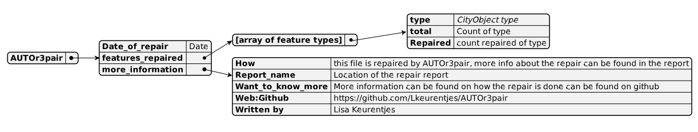
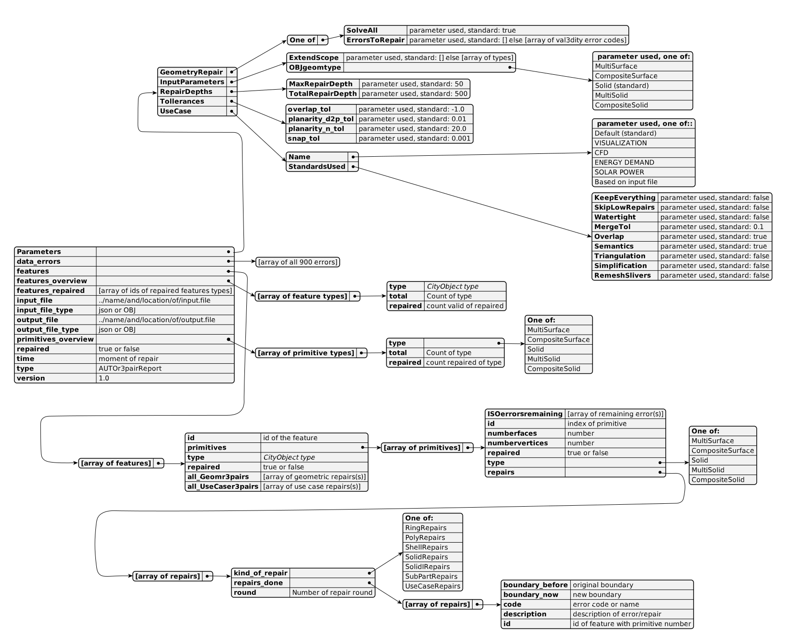

# 3D city model
The repaired 3D city models will be saved in their original formats (CityJSON or OBJ). If no repairs are made (i.e., the file remains unchanged), no output model will be generated.

## CityJSON Output

- The output is created by copying the original file, preserving untouched properties (such as type, version, and transform).
- This ensures that non-obligatory properties (like metadata and appearance) are retained in the repaired model.
- The original vertices array will be replaced with the new array, and the CityObjects array will be populated by converting TU3dJSONs back to CityObjects (see Figure COtoTU3d).
- An additional key, **AUTOr3pair**, will be added, detailing when the model was repaired, the number of each feature repaired, and information about the program and the location of the Repair report (see Section repairReport).
- If the `addrepair` parameter is utilized, an **AUTOrepair** key will be included for every CityObject, indicating the repairs performed on it.

## OBJ Output

- The output is generated using CGAL's I/O stream package, which writes vertices and polygons from a specified range.
- The vertices will be sourced from the repaired vertices array, while the polygons will come from the CityObject "like" (see Figure OBJtoTU3d).
- CGAL handles the conversion from 0-based to OBJ's 1-based boundaries.
- Currently, objects are not grouped in the OBJ output.

# Repair Report
In addition to the repaired 3D city model, a repair report is also generated. The repair report provides clarification to the user on how the 3D city model was repaired. It is similar in structure to a val3dity report in JSON format. The schema used in the report is visualized in [Figure 1](#fig:RepairReport). The report consists of 14 properties, each of which is meant to be self-explanatory.

The key `Parameters` displays the parameters used during the repair process (as explained in [User Standards](#subsec:userstandards)), so the user can see which factors influenced the repairs. The `Data_errors` key is used when a file is unreadable or when val3dity outputs a data error. The `features_overview` and `primitives_overview` keys show the number of repaired objects per type. `input_file` and `output_file` provide details on which file was repaired and where the repaired 3D city model is saved.

To provide additional metadata on the repair process, the `time` key indicates the timestamp of the repair, and the `version` key specifies the version of AUTOr3pair that was used. The `type` key is always set to `AUTOr3pairReport`.

The `repaired` key is a boolean that shows whether anything in the 3D city model was repaired. The `Features` key contains an array of all features, with the subkey `repaired` indicating if a feature was repaired. The `features_repaired` key lists all the IDs of repaired features.

For more detailed information on the repairs, the user can check the `Primitive` key to see the order in which repairs were applied. The `repairs` key provides a breakdown per round of what kind of repair(s) were performed. For each repair, the ID/name, description, and boundary change are displayed by showing the `boundary_before` and `boundary_after`.

To make boundary changes clear, any conversion between 0-based boundaries and OBJ's 1-based boundaries is handled before the report is written.

